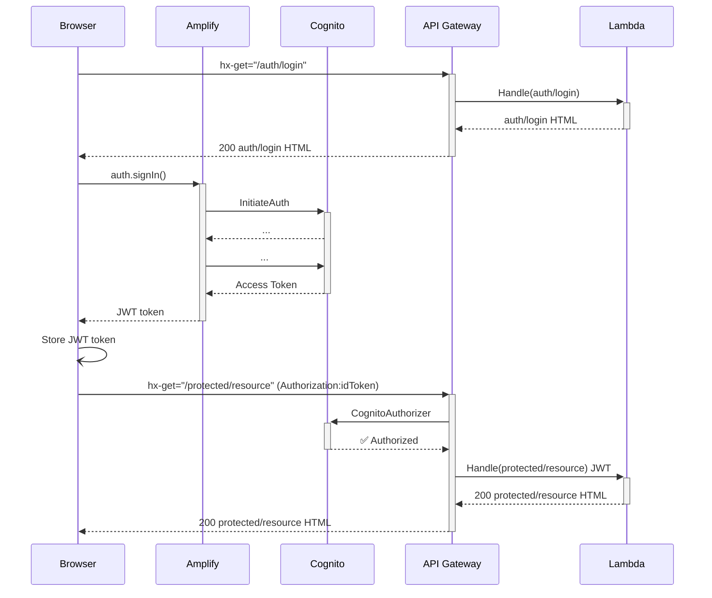
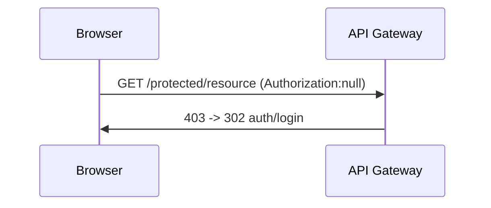

HTMX Cognito Demo
=================

## Building

GOOS=linux GOARCH=arm64 sam build

## Custom Domain

Why use a custom domain?  When attempting to use the default distribution domains with the API Gateway the SAM template would eventually fail with circular dependency errors.

# Using AWS Cognito with HTMX

Using the HTMX library, in conjunction with the AWS Amplify Auth Javascript libraries, I'm able to:
1. Authenticate a user with a Cognito user pool
2. Store the authentication token local to the browser
3. Use the token as an Authorization header value to authorize requests with the CognitoAuthorizer.

The only remaining flow is to handle requests that are made directly to a protected resource URL.

## Authorized HTMX Requests

The browser is communicating with the API Gateway using the htmx library so it is possible to enrich requests with the Authorization header derived from the locally stored Auth token managed by AWS Amplify.

## Unauthorized Redirect

When a request is made directly to a protected resource, the required Authorization header is not present. Even though the browser may have a valid Access Token stored locally, it will not be provided in the Authorization header because the htmx library is not making the call.

### Previous SPA Approach

My previous approach using Angular was to have the 403 response modified to a 200 response that included the Angular application in the payload. The Angular application would then handle the authorization internally and make the requisite API calls based on the url path that was "rejected" by the API Gateway.

I think a similar approach is possible with HTMX but I'm not sure what the appropriate sequence is.
